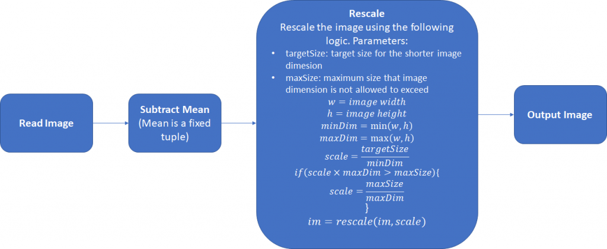
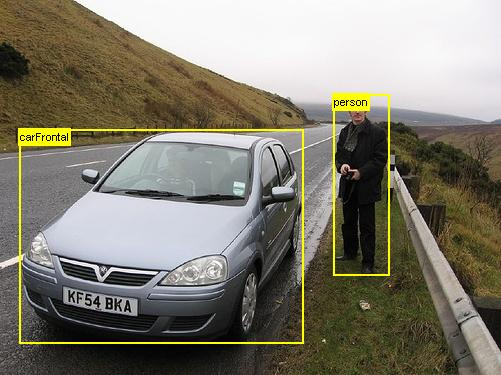
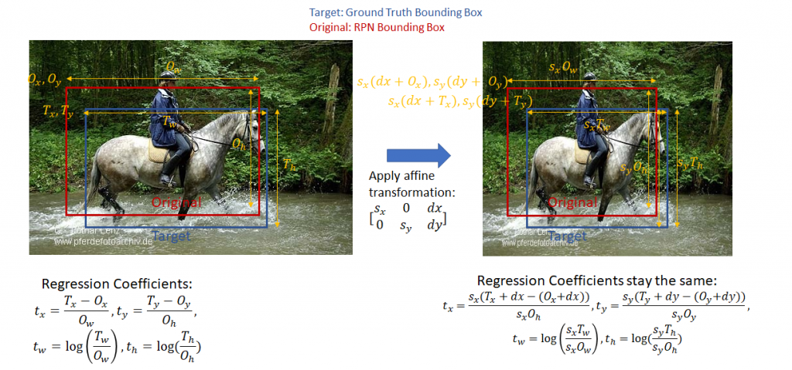
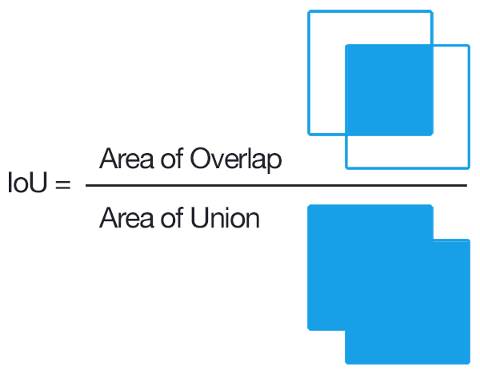

# 基于R-CNNs的目标检测和分类
------

**作者：Ankur Mohan    译者：leon**

R-CNN对于一般图片集进行检测和识别是非常高效的，它的mAP得分同等高于以前的技术，Ross Girshick 和 al将R-CNN的方法在下面的论文中进行了描述。

1. R-CNN (Girshick et al. 2013)*
2. Fast R-CNN (Girshick 2015)*
3. Faster R-CNN (Ren et al. 2015)*

最新的R-CNN方法是在最近的一篇论文Faster R-CNN中进行描述的，我最先考虑重第一篇论文到最后一篇论文描述该方法的演变，但我发现那是一个充满野心的事业。最后我静下来开始详细在博客中介绍最后一篇论文中的Faster R-CNN方法。

非常幸运，这里有很多实现R-CNN算法的工具，比如TensorFlow, PyTorch和其他机器学习的库。我的实现方法在已上传到我的[github](https://github.com/ruotianluo/pytorch-faster-rcnn)上。

在此文种使用的很多术语（比如，不同layer的名字）与代码中的保持一致。理解该文的信息将使你更容易的理解PyTorch和你自己进行实践。

## 文章组成

**section 1 - 图片的预处理**：本节中，我们将描述输入图片的预处理过程。这些过程包括平均像素值和缩放图像。在训练和推理之间的预处理过程必须相同。

**section 2 - 网络组织**：本节中，我们将介绍3种主要的网络组件，“head”网络、RPN网络和classification网络。

**section 3 - 训练模型的具体实现**：这一节作为该文最长的小节，介绍了训练一个R-CNN网络的具体实现。

**section 3 - 推理的具体实现**：这一节我们将描述推理过程，比如使用训练好了的R-CNN网络去判定兴趣区域（ROI），并在该区域中进行对象的分类。

**附录**：这里我们附加了一些在R-CNN中的常用算法，比如non-maximum-suppression和Resnet 50 architecture。

## 图片的预处理

在下图中的预处理过程在将一张图片送入网络前对该图片进行处理，这些预处理过程在训练和推理过程中必须保持一致。平均向量（3*1，每一个数字对应一个颜色通道）不是指当前图片的像素均值，而是对每一个训练和测试图片一致的 configuration value。

预定义的参数值是targetSize = 600，maxSize = 1000。

## 网络组织

一个R-CNN网络使用神经网络解决2个主要的问题：

> * 识别一个输入图片的兴趣区域（ROI）内可能包含的前景对象。
> * 计算兴趣区域（ROI）内对象类型的概率分布，比如：计算兴趣区域（ROI）包含某个类别的对象的概率，然后用户可以选择概率最高的对象类别作为分类结果。

R-CNNs主要包含3种网络类型：

1. Head
2. Region Proposal Network (RPN)
3. Classification Network

R-CNNs首先使用前几层网络层作为预训练网络（ResNet 50）在一张输入图片中去识别兴趣特性。由于神经网络具有“转移学习”功能，因此可以使用针对一个不同问题在一个数据集上训练的网络（Yosinski等人，2014）*。前几层网络层的预训练网络学习检测一般的特征，比如边界和颜色斑点（color blobs），这些特征在不同问题中是很好的区别特征。后面几层网络层的学习是更高级别的，针对更多特别问题的特征进行学习。这些网络层可以被移除，或者在反向传播（back-propagation）过程中微调（fine-tuned）这些网络层的权重。从预训练网络初始化前几层网络层构成“head”网络。“head”网络生成卷积特征图然后传递给RPN网络，RPN网络通过多个卷积层和多个全连接层生成兴趣区域（ROIS），该兴趣区域（ROIS）可能包含一个前景对象（(problem 1 mentioned above）。通过“head”网络生成的特征图按照前面的兴趣区域（ROIS）进行裁剪，在特征图上生成相应的推荐兴趣区域（ROIS），这个过程叫做“Crop Pooling”。通过“Crop Pooling”生成的区域传递给一个classification network网络，然后该网络对生成区域内的对象进行分类学习。

### 网络架构

下图显示了上述三种网络类型的各个组成部分。我们显示每一个网络层输入和输出的维度，以便帮助我们了解数据是怎样在网络的每一层传播的。w 和 h代表输入图片预处理后的宽和高。

## 训练模型的具体实现

在这一小节我们将详细描述训练一个R-CNN网络所涉及的过程，一旦你理解了训练过程，那么理解推理过程就是一件很容易的事情，因为推理过程使用的的训练过程中的一部分。训练过程的目标是优化RPN网络和Classification网络的权重，同时微调“head”网络中的权重（这一系列的权重都在预训练网络-e.g:ResNet网络中被初始化）。回想一下，RPN网络的工作是生成推荐的兴趣区域ROIs，Classification网络的工作是给每一个前面推荐的兴趣区域ROI打分。因此为了训练这些网络，我们需要对应的*Ground Truth*,即一张图片中对象(Objects)的*bounding boxes*坐标和对象的种类(Class)。*Ground Truth*来自于一些免费的图片数据库，这些图片数据库里的每一张图片都有一个标注文件。这些标注文件包含了图片中对象(Objects)的*bounding boxes*坐标，和这些对象对应的分类标签（class label）（这些对象的分类信息来自预先定义的对象分类表中）。这些图像数据库已用于支持各种对象分类和目标检测应用。两种常用的数据库是：

+ PASCAL VOC: VOC 2007数据库有9963张图片，其中包含20个对象分类的24,640个标注。
   + Person: person
   + Animal: bird, cat, cow, dog, horse, sheep
   + Vehicle: aeroplane, bicycle, boat, bus, car, motorbike, train
   + Indoor: bottle, chair, dining table, potted plant, sofa, tv/monitor

图片类容如图：

+ COCO (Common Objects in Context): COCO数据库更大，包含90个对象分类和多于200,000个标注的图片。

我使用PASCAL VOC 2007数据集用于该项目的训练。 R-CNN网络能够在同一步骤中训练RPN网络和classification网络。

让我们花一点时间来探讨在本文的其余部分中广泛使用的“边界框回归系数”（“bounding box regression coefficients”）和“边界框重叠”（“bounding box overlap”）的概念。

* 边界框回归系数（bounding box regression coefficients）：R-CNN的目标之一，就是生成良好的边界框，该边界框能紧密趋近真实对象的边界框。R-CNN通过采用给定的边界框（由左上角的坐标，宽度和高度定义）并通过应用一组“回归系数”来调整其左上角，宽度和高度来生成回归边界框。计算系数可以查看该文章[计算系数](https://arxiv.org/pdf/1311.2524.pdf)。让我们定义目标边界框左上角坐标为T_x，T_y;原始边界框左上角坐标为O_x,O_y;然后定义目标边界框的宽/高为T_w,T_h;原始边界框的宽/高为O_w,O_h。然后，回归目标（将原始边界框转换为目标框的函数的系数）为：

   + t_x = (T_x - O_x)/O_w, t_y = (T_y-O_y)/O_h, t_w = log(T_w/O_w), t_h = log(T_h/O_h).这个函数是可逆的，即已知回归系数和原始边界框的左上角的坐标，宽度和高度，很容易计算出目标边界框的左上角的坐标，宽度和高度。注：针对一个未剪切的仿射变换，回归系数是不可变的，在算分类损失时这一点很重要，目标回归系数以原始比例计算，而分类网络输出的回归系数是通过在ROI pooling层以特征图（按1：1的比列）计算的。在我们讨论分类损失后，这些问题将更加清晰。

   

   + 交并比重叠（Intersection over Union (IoU) Overlap）：我们需要某种方法来衡量给定的边界框与另一个边界框的距离，该边界框与用来测量边界框尺寸的单位（像素等）无关。这种测量方法应直观（两个重合的边界框值为1，而两个不重叠的框值为0），并且快速且易于计算。常用的计算方法是交并比交并比重叠（Intersection over Union (IoU) Overlap），计算方式如下图所示。

   

有了这些初步的准备，我们开始深入了解训练R-CNN的实施细节。在软件实现中，R-CNN执行分为以下几层。每一层封装了一系列逻辑步骤，这些步骤可能涉及通过一种神经网络运行数据或者执行其他过程，例如比较边界框之间的重叠，执行非最大值抑制（non-maxima suppression）等。

* Anchor生成层（Anchor Generation Layer）：该层预先生成9个不同大小和不同比例的 “anchors” (bounding boxes)，然后按照均匀间隔在网格点划分的图片上平移anchors来复制所有的anchors。

* 推荐层（Proposal Layer）：根据边界框回归系数（bounding box regression coefficients）生成变化后的anchors。然后通过对anchor为前景区域的概率计算以非最大抑制方法（请参阅附录）来修剪anchors的数量。

* Anchor目标层（Anchor Target Layer）：该层的目标是为训练RPN网络生成“优良的”anchors集、对应的前景/背景标签和目标回归系数。这些生成的数据集将仅仅用于RPN层，不会用在classification层。已知一个anchors集（该anchors集是“Anchor生成层”的输出，通过“Anchor目标层”标识他们的前景和背景anchors。前景anchors是那些与某个Ground Truth框重叠的区域高于阈值的anchors。背景anchors是那些与任何Ground Truth框重叠的区域的重叠度低于阈值的框。);"Anchor目标层"还输出一组边界框回归量，即离每个目标anchor距最近的边界框有多远。这些回归变量仅对前景框有意义，因为背景框没有“最近边界框”的概念。