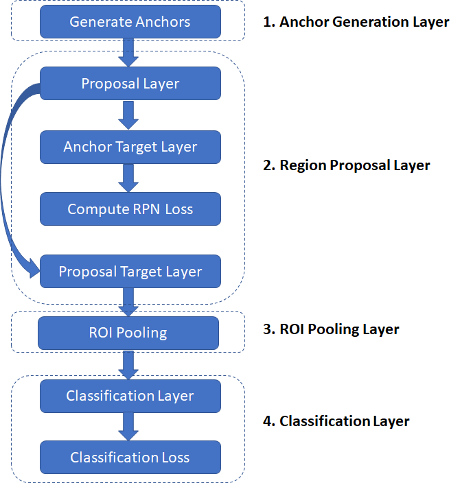
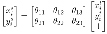

# 基于R-CNNs的目标检测和分类
------

**作者：Ankur Mohan    译者：leon**

R-CNN对于一般图片集进行检测和识别是非常高效的，它的mAP得分同等高于以前的技术，Ross Girshick 和 al将R-CNN的方法在下面的论文中进行了描述。

1. R-CNN (Girshick et al. 2013)*
2. Fast R-CNN (Girshick 2015)*
3. Faster R-CNN (Ren et al. 2015)*

最新的R-CNN方法是在最近的一篇论文Faster R-CNN中进行描述的，我最先考虑重第一篇论文到最后一篇论文描述该方法的演变，但我发现那是一个充满野心的事业。最后我静下来开始详细在博客中介绍最后一篇论文中的Faster R-CNN方法。

非常幸运，这里有很多实现R-CNN算法的工具，比如TensorFlow, PyTorch和其他机器学习的库。我的实现方法在已上传到我的[github](https://github.com/ruotianluo/pytorch-faster-rcnn)上。

在此文种使用的很多术语（比如，不同layer的名字）与代码中的保持一致。理解该文的信息将使你更容易的理解PyTorch和你自己进行实践。

## 文章组成

**section 1 - 图片的预处理**：本节中，我们将描述输入图片的预处理过程。这些过程包括平均像素值和缩放图像。在训练和推理之间的预处理过程必须相同。

**section 2 - 网络组织**：本节中，我们将介绍3种主要的网络组件，“head”网络、RPN网络和classification网络。

**section 3 - 训练模型的具体实现**：这一节作为该文最长的小节，介绍了训练一个R-CNN网络的具体实现。

**section 3 - 推理的具体实现**：这一节我们将描述推理过程，比如使用训练好了的R-CNN网络去判定兴趣区域（ROI），并在该区域中进行对象的分类。

**附录**：这里我们附加了一些在R-CNN中的常用算法，比如non-maximum-suppression和Resnet 50 architecture。

## 图片的预处理

在下图中的预处理过程在将一张图片送入网络前对该图片进行处理，这些预处理过程在训练和推理过程中必须保持一致。平均向量（3*1，每一个数字对应一个颜色通道）不是指当前图片的像素均值，而是对每一个训练和测试图片一致的 configuration value。

预定义的参数值是targetSize = 600，maxSize = 1000。

## 网络组织

一个R-CNN网络使用神经网络解决2个主要的问题：

> * 识别一个输入图片的兴趣区域（ROI）内可能包含的前景对象。
> * 计算兴趣区域（ROI）内对象类型的概率分布，比如：计算兴趣区域（ROI）包含某个类别的对象的概率，然后用户可以选择概率最高的对象类别作为分类结果。

R-CNNs主要包含3种网络类型：

1. Head
2. Region Proposal Network (RPN)
3. Classification Network

R-CNNs首先使用前几层网络层作为预训练网络（ResNet 50）在一张输入图片中去识别兴趣特性。由于神经网络具有“转移学习”功能，因此可以使用针对一个不同问题在一个数据集上训练的网络（Yosinski等人，2014）*。前几层网络层的预训练网络学习检测一般的特征，比如边界和颜色斑点（color blobs），这些特征在不同问题中是很好的区别特征。后面几层网络层的学习是更高级别的，针对更多特别问题的特征进行学习。这些网络层可以被移除，或者在反向传播（back-propagation）过程中微调（fine-tuned）这些网络层的权重。从预训练网络初始化前几层网络层构成“head”网络。“head”网络生成卷积特征图然后传递给RPN网络，RPN网络通过多个卷积层和多个全连接层生成兴趣区域（ROIS），该兴趣区域（ROIS）可能包含一个前景对象（(problem 1 mentioned above）。通过“head”网络生成的特征图按照前面的兴趣区域（ROIS）进行裁剪，在特征图上生成相应的推荐兴趣区域（ROIS），这个过程叫做“Crop Pooling”。通过“Crop Pooling”生成的区域传递给一个classification network网络，然后该网络对生成区域内的对象进行分类学习。

### 网络架构

下图显示了上述三种网络类型的各个组成部分。我们显示每一个网络层输入和输出的维度，以便帮助我们了解数据是怎样在网络的每一层传播的。w 和 h代表输入图片预处理后的宽和高。

## 训练模型的具体实现

在这一小节我们将详细描述训练一个R-CNN网络所涉及的过程，一旦你理解了训练过程，那么理解推理过程就是一件很容易的事情，因为推理过程使用的的训练过程中的一部分。训练过程的目标是优化RPN网络和Classification网络的权重，同时微调“head”网络中的权重（这一系列的权重都在预训练网络-e.g:ResNet网络中被初始化）。回想一下，RPN网络的工作是生成推荐的兴趣区域ROIs，Classification网络的工作是给每一个前面推荐的兴趣区域ROI打分。因此为了训练这些网络，我们需要对应的*Ground Truth*,即一张图片中对象(Objects)的*bounding boxes*坐标和对象的种类(Class)。*Ground Truth*来自于一些免费的图片数据库，这些图片数据库里的每一张图片都有一个标注文件。这些标注文件包含了图片中对象(Objects)的*bounding boxes*坐标，和这些对象对应的分类标签（class label）（这些对象的分类信息来自预先定义的对象分类表中）。这些图像数据库已用于支持各种对象分类和目标检测应用。两种常用的数据库是：

+ PASCAL VOC: VOC 2007数据库有9963张图片，其中包含20个对象分类的24,640个标注。
   + Person: person
   + Animal: bird, cat, cow, dog, horse, sheep
   + Vehicle: aeroplane, bicycle, boat, bus, car, motorbike, train
   + Indoor: bottle, chair, dining table, potted plant, sofa, tv/monitor

图片类容如图：

+ COCO (Common Objects in Context): COCO数据库更大，包含90个对象分类和多于200,000个标注的图片。

我使用PASCAL VOC 2007数据集用于该项目的训练。 R-CNN网络能够在同一步骤中训练RPN网络和classification网络。

让我们花一点时间来探讨在本文的其余部分中广泛使用的“边界框回归系数”（“bounding box regression coefficients”）和“边界框重叠”（“bounding box overlap”）的概念。

* 边界框回归系数（bounding box regression coefficients）：R-CNN的目标之一，就是生成良好的边界框，该边界框能紧密趋近真实对象的边界框。R-CNN通过采用给定的边界框（由左上角的坐标，宽度和高度定义）并通过应用一组“回归系数”来调整其左上角，宽度和高度来生成回归边界框。计算系数可以查看该文章[计算系数](https://arxiv.org/pdf/1311.2524.pdf)。让我们定义目标边界框左上角坐标为T_x，T_y;原始边界框左上角坐标为O_x,O_y;然后定义目标边界框的宽/高为T_w,T_h;原始边界框的宽/高为O_w,O_h。然后，回归目标（将原始边界框转换为目标框的函数的系数）为：

   + t_x = (T_x - O_x)/O_w, t_y = (T_y-O_y)/O_h, t_w = log(T_w/O_w), t_h = log(T_h/O_h).这个函数是可逆的，即已知回归系数和原始边界框的左上角的坐标，宽度和高度，很容易计算出目标边界框的左上角的坐标，宽度和高度。注：针对一个未剪切的仿射变换，回归系数是不可变的，在算分类损失时这一点很重要，目标回归系数以原始比例计算，而分类网络输出的回归系数是通过在ROI pooling层以特征图（按1：1的比列）计算的。在我们讨论分类损失后，这些问题将更加清晰。

   

   + 交并比重叠（Intersection over Union (IoU) Overlap）：我们需要某种方法来衡量给定的边界框与另一个边界框的距离，该边界框与用来测量边界框尺寸的单位（像素等）无关。这种测量方法应直观（两个重合的边界框值为1，而两个不重叠的框值为0），并且快速且易于计算。常用的计算方法是交并比交并比重叠（Intersection over Union (IoU) Overlap），计算方式如下图所示。

   

有了这些初步的准备，我们开始深入了解训练R-CNN的实施细节。在软件实现中，R-CNN执行分为以下几层。每一层封装了一系列逻辑步骤，这些步骤可能涉及通过一种神经网络运行数据或者执行其他过程，例如比较边界框之间的重叠，执行非最大值抑制（non-maxima suppression）等。

* Anchor生成层（Anchor Generation Layer）：该层预先生成9个不同大小和不同比例的 “anchors” (bounding boxes)，然后按照均匀间隔在网格点划分的图片上平移anchors来复制所有的anchors。

* 推荐层（Region Proposal Layer）：根据边界框回归系数（bounding box regression coefficients）生成变化后的anchors。然后通过对anchor为前景区域的概率计算以非最大抑制方法（请参阅附录）来修剪anchors的数量。

* Anchor目标层（Anchor Target Layer）：该层的目标是为训练RPN网络生成“优良的”anchors集、对应的前景/背景标签和目标回归系数。这些生成的数据集将仅仅用于RPN层，不会用在classification层。已知一个anchors集（该anchors集是“Anchor生成层”的输出，通过“Anchor目标层”标识他们的前景和背景anchors。前景anchors是那些与某个Ground Truth框重叠的区域高于阈值的anchors。背景anchors是那些与任何Ground Truth框重叠的区域的重叠度低于阈值的框。);"Anchor目标层"还输出一组边界框回归量，即离每个目标anchor距最近的边界框有多远。这些回归变量仅对前景框有意义，因为背景框没有“最近边界框”的概念。

* RPN损失（RPN Loss）：RPN损失函数是在训练RPN网络优化过程中最小化的指标。损失函数是以下各项的组合：
    * 由RPN产生并正确分类为前景/背景的bounding boxes的比例
    * 预测回归系数与目标回归系数之间的一些测量差

* 推荐目标层（Proposal Target Layer）：这一层的目标是裁剪推荐层（Region Proposal Layer）生成的anchors数据，同时生成特定类的目标回归边界框数据，将这些数据用于训练classification层（classification layer），然后生成优良的的类标签和回归目标。

* ROI池化层（ROI Pooling Layer）: 实现空间变换网络，该空间转换网络将会在给定的推荐目标层（Proposal Target Layer）所生成的推荐区域边界坐标内，对输入特征图进行采样。这些坐标通常不会位于整数边界上，因此需要基于插值的采样。

* Classification层（Classification Layer）：该层获取由ROI池化层处理输出的特征图，并将其传递给一系列卷积层。最后卷积层的输出将传递给两个全连接层。其中一个全连接层生成每一个推荐区域的种类的概率分布，另一个全连接生成特定种类的回归边界框数据集（bounding box regressors）。

* 分类损失（Classification Loss）：和RPN损失相似，分类损失时对训练Classification层优化过程中最小化的指标。在反向传播过程中，误差梯度也会流到RPN网络，因此训练classification层也会修改RPN网络的权重。我们将在后面更多的对此进程讨论。分类损失是以下各项的组合：
   * 由RPN产生并正确分类bounding boxes比例（正确的对象类）
   * 预测值和目标回归系数的一些测量差

现在我们深入每一层然后进行梳理。

### Anchor生成层（Anchor Generation Layer）

Anchor生成层在所有图片上生成不同尺寸和比例边界框（bounding boxes）集合（被叫做“anchor boxes”），这些bounding boxes对所有图片都是一样的，即它们与图像的内容无关。其中一些bounding boxes会包围前景对象，而大多数bounding boxes则不会。RPN网络的目标是学会标识哪些边界框是优良的bounding boxes，即可能包含前景对象，并生成目标回归系数，这些目标回归系数使anchor box优化成更好地bounding box（更紧密的包围前景对象）。

下图演示了anchor boxes是怎样产生的。

 anchor boxes

### 推荐层（Region Proposal Layer）

目标检测方法需要“区域推荐系统”作为输入，该系统会生成一组稀疏特征（例如，[选择性搜索](https://doi.org/10.1109/TPAMI.2009.167)）或密集特征（例如，[例如用于可变形零件模型的特征集](https://doi.org/10.1109/TPAMI.2009.167)）。在最早版本的R-CNN系统中，使用选择性搜索方法（selective search method）生成推荐区域。在“Faster R-CNN”版本中，基于Anchor生成层中提到的“滑动窗口”，该“滑动窗口”用于生成一组密集的候选区域，然后使用神经网络驱动的RPN网络根据包含前景对象的区域的概率对推荐区域进行排名。推荐层（Region Proposal Layer）有两个目标：

* 在anchors中，标识背景anchors和前景anchors
* 通过“回归系数”集修改anchors的坐标，宽和高，达到优化anchors的目的（比如，使他们更接近对象边界）

推荐层包含RPN网络和一个三层结构（推荐层（Proposal Layer），目标层（Anchor Target Layer）和推荐目标层（Proposal Target Layer））。这个三层结构在后面的小节中将详细介绍给大家。

### PRN网络（Region Proposal Network）

推荐层（proposal layer）通过一个卷积层（代码中是rpn_net）和对应的RELU函数来处理“head”网络生成的特征图。rpn_net的输出通过2个（1，1）的卷积核处理后分别生成背景/前景种类得分（scores）和背景/前景种类概率，同时生成对应的边界框回归系数。“head”网使用的步幅（stride）长度和生成anchors的步幅（stride）长度一致，因此anchor boxes的生成数量和RPN网生成的信息一一对应（anchor boxes数量= class scores数量=边界框回归系数的数量=w/16*h/16*9）。

### 推荐层（Proposal Layer）

推荐层（proposal layer）使用Anchor生成层输出的anchor boxes，基于前景得分通过非最大抑制（non-maximum suppression）来修剪anchors的数量（有关详细信息，请参见附录）。同时该层通过使用RPN网络生成的回归系数应用于相应anchor boxes来生成变换后的边界框（bounding boxes）

### 目标层（Anchor Target Layer）

该层的目标是选择推荐的anchors，运用这些anchors来训练RPN网络实现以下2点功能：

1. 区分前景区域和背景区域
2. 为每一个前景box（the foreground boxes）生成优良的边界回归系数

在上面介绍的RPN损失计算过程中，以上2点功能非常有用。这将明确计算RPN损失所需的信息，从而使目标层（Anchor Target Layer）的操作变得容易。

### 计算RPN损失（Calculating RPN Loss）

RPN层的主要目标是生成优良的边界框。在一个anchor boxes集合中，为了达到这个目的，RPN层必须学习两个功能，其一是将一个anchor box分类成前景或者后景，其二是计算回归系数然后修改前景边界框的位置、宽和高，以生成“优良的”前景框（更加紧密的包围前景对象）。RPN损失函数通过激励网络来学习以上功能。

RPN_loss = Classification_loss + Bounding_Box_Regression_loss。Classification损失使用交叉熵损失对错误的分类框进行惩罚，回归损失使用真实回归系数（使用离Ground Truth框最近的前景框计算）与网络的预测框回归系数（请参阅RPN网络架构图中的rpn_bbx_pred_net）的来计算函数差。

#### Classification Loss函数:

cross_entropy(predicted _class, actual_class)

#### Bounding Box Regression Loss函数:

上面公式意思是所有前景anchors的回归损失的和。对背景anchors进行计算没有意义，因为ground truth box和背景anchor没有联系。

上面公式显示了已知前景的回归损失是怎样计算的。我们计算预测值（RPN网络）和目标回归系数（
使用最接近ground truth box的anchor box计算）的差。这里包含四个部分分别是边界框的左上角坐标，宽和高。smooth L1函数定义如下：

上面公式sigma是任意值（代码中设为3）。注：在python实现中，前景anchor的数组是（“bbox_inside_weights”）用于将损失作为矢量运算来计算，并避免for-if循环。

因此，要计算损失，我们需要计算以下内容：
1. 类别标签（背景或前景）和anchors boxes得分
2. 前景anchors boxes的目标回归系数

我们将跟随目标层（Anchor Target Layer）的实现去了解上面2个内容是怎么计算的。我们首先选择一张图片范围内的anchor boxes。然后，计算该图片范围内的所有anchor boxes和所有ground truth boxes的交并比重叠（Intersection over Union (IoU) Overlap）来选择优良的前景boxes。通过使用重叠信息，两种类型的框被标注为前景框：

1. type A：对每一个ground truth box，所有的前景框和ground truth box计算得出最大的交并比（IOU）。
2. type B：anchor boxes和一些ground truth box的交并比超过一个阈值。

如下图所示：

注：仅当anchor boxes与某些ground truth box的重叠部分超过阈值的时，这些anchor boxes才被选择为前景框。这样做是为了避免向RPN网络提供“无希望的学习任务”，即不用去学习那些离ground truth box太远的boxes的回归系数。同样的，boxes重叠部分小于一个负阀值时，被标注为背景框。不是所有非前景框的boxes就会标注为背景框。既不是前景框也不是背景框的boxes将被标注为“don’t care”，这些boxes将不会用于RPN损失的计算。

针对前景和后景框的总数，还有两个附加的阀值对其进行控制，这个总数的分数设为前景。如果通过测试的前景框数量超过了阀值，我们会随机将多余的前景框标记为“无关”。类似的逻辑也应用于背景框。

接着我们按照最大重叠原则计算前景框和对应ground truth box的bounding box回归系数。这很容易，只需遵循以下公式即可计算回归系数。

至此，我们对目标层（Anchor Target Layer）的讨论已经结束。回顾一下，让我们列出目标层的参数、输入和输出：

#### 参数

* TRAIN.RPN_POSITIVE_OVERLAP（阀值：默认0.7）: 判断一个anchor box是否是优良前景框的阀值。
* TRAIN.RPN_NEGATIVE_OVERLAP（阀值：默认0.3）: 如果anchor与ground truth box的最大重叠部分小于该阀值，这个anchor被标注为背景；如果重叠部分大于RPN_NEGATIVE_OVERLAP但小于RPN_POSITIVE_OVERLAP，该anchor被标注为“don’t care”。
* TRAIN.RPN_BATCHSIZE: 前景和背景anchors的总数。（默认：256）
* TRAIN.RPN_FG_FRACTION: 前景anchors的batch size分数(默认：0.5)。如果被找到的前景anchors数量大于TRAIN.RPN_BATCHSIZE*TRAIN.RPN_FG_FRACTION，超出的部分（包括随机选择的部分）被标注为“don’t care”。

#### 输入

* RPN Network Outputs（被预测的前景/背景类标签，回归系数）
* Anchor boxes（目标层（Anchor Target Layer）生成）
* Ground truth boxes

#### 输出

* 优良的前景/背景框，和前景对应的类标注
* 目标回归系数

其它层，推荐目标层（proposal target layer），ROI卷积层（ROI Pooling layer）和分类层（classification layer）旨在生成计算classification loss所需要的信息。和目标层（Anchor Target Layer）一样，接下来我们将介绍需要什么数据来计算classification loss，以及怎样计算。

### 计算分类网络损失（Classification Layer Loss）

和RPN网络损失相似，分类网络损失由分类损失（ classification loss）和边界框回归损失（bounding box regression loss）两部分组成。

Classification Layer Loss = Classification Loss + Bounding Box Regression Loss

RPN网络和分类网络主要的不同是，RPN网络主要处理前景和背景两个种类，分类网络是将所有对象类（包括背景）在网络学习后进行分类。

分类损失（classification loss）是真实分类和预测分类的交叉熵损失，计算过程如下图所示：

边界框回归损失的计算除回归系数相关的是具体种类，其他和RPN网络相似。该网络会对每一种对象分类计算回归系数。目标回归系数只对正确分类有用，该正确分类表示ground truth bounding box与anchor box最大重叠区域内的对象分类。当计算损失时，使用一个mask array标记每一个anchor box中正确的对象分类。不正确的对象分类的回归系数被忽略。该mask array将损失计算作矩阵乘法，而不是逐条循环。

因此，需要以下内容来计算分类层的损失：

1. 预测分类标注和边界框回归系数（这些都是分类网络的输出）
2. 每一个anchor box的分类标注
3. 目标边界框回归系数

现在让我们看一下以上内容在推荐目标网络（Proposal Target Layer）和分类网络（classification layers）中如何被计算。

### 推荐目标网络（Proposal Target Layer）

推荐目标网络将从推荐网络（proposal layer）的输出ROIs中选择推荐的ROIs。“head”层生成的特征图将会按照这些推荐ROIs部分进行裁剪池化（crop pooling），然后将结果传递给剩下的网络（重头到尾）来计算预测的分类得分和框回归系数。

和目标层（Anchor Target Layer）一样，但重要的是选择优良的推荐内容（即与Ground Truth框有明显重叠的部分）传递给分类网络（classification layer）。否则，我们将要求分类网络（classification layer）学习一项“无希望的学习任务”。

推荐目标网络（Proposal Target Layer）基于推荐网络（proposal layer）所计算的ROIs。使用每一个ROI与ground truth boxes的最大重叠部分分类为背景和前景的ROIs。前景ROIs是那些最大重叠部分超过阀值的（TRAIN.FG_THRESH, 默认: 0.5）。背景ROIs是那些最大重叠部分介于TRAIN.BG_THRESH_LO和TRAIN.BG_THRESH_HI之间的（对应的默认值是0.1, 0.5）。这是“hard negative mining”的一个示例，用于列举困难背景分类示例。

还有一些其他逻辑试图确保前景和背景区域的总数是恒定的。如果发现背景区域太少，它会尝试通过随机重复一些背景索引填充batch来弥补该不足。

然后，通过在每一个ROI和最接近匹配ground truth box（包括背景ROIs，因为ground truth box的重叠部分也存在于这些背景ROIs中）间进行计算来得到目标边界框回归目标。如下图所示，这些回归目标针对所有类别进行了扩展。

bbox_inside_weight数组可以看做一个标记，它只有1个正确的分类在每一个前景ROI中，同样的在背景ROIs中没有正确分类。因此，在计算分类网络损失的边界框回归分量时，仅考虑前景区域的回归系数。背景ROIs包括背景分类不属于分类损失计算的内容。

#### 输入：
* 推荐层（proposal layer）生成的ROIs
* ground truth信息

#### 输出：
* 满足重叠条件的被选定的前景ROI和背景ROI
* ROIs的特定目标分类回归系数

#### 参数：
* TRAIN.FG_THRESH:（默认：0.5）用来选择前景ROIs。与ground truth box最大重叠部分超过FG_THRESH了的ROI被标注为前景
* TRAIN.BG_THRESH_HI: (默认：0.5)
* TRAIN.BG_THRESH_LO: (默认：0.1)通过两个阀值可以确定背景ROIs。与ground truth box最大重叠部分介于BG_THRESH_HI和BG_THRESH_LO之间的部分被标记为背景。
* TRAIN.BATCH_SIZE: (默认：128)所选择的前景和背景框的最大总数。
* TRAIN.FG_FRACTION: (默认：0.25)前景框的总数不能超过BATCH_SIZE*FG_FRACTION

### 裁剪池（Crop Pooling）：

推荐目标网络（Proposal Target Layer）生成推荐的ROIs，在训练期间使用的相关类别标签和回归系数帮助我们进行分类。下一步是从“head”网络生成的卷积特征图中提取这些ROIs对应的区域。被提取出来的特征图将在剩下的网络（“tail”在下图中显示）中被使用，然后生成对象分类的概率分布和每一个ROI的回归系数。裁剪池（Crop Pooling）的工作是从卷积特征图中提取出区域。

裁剪池（Crop Pooling）的主要思想在论文[“Spatial Transformation Networks”](https://arxiv.org/pdf/1506.02025.pdf)中，进行了详细描述。目标是使用一个变形函数（被描述为2×3的仿射变换矩阵）将输入的特征图转化为输出的变形特征图。这个过程如下图所示：

在裁剪池（Crop Pooling）有两个步骤：

1. 在一个目标坐标集中，使用已知的的仿射变换矩阵生成一个坐标资源网格。

这里是高/宽归一化后的坐标（类似于图形中使用的纹理坐标），所以。
2. 在这第二步中，在（源）坐标处对输入（源）图进行采样以生成输出（目标）图。在这一步中，每一个坐标定义输入中应用采样核（例如双线性采样核）以获取输出特征图中特定像素处的值的空间位置。

空间变换中描述的采样方法提供了一种可微分的采样机制，允许损失梯度返回到输入要素图和采样网格坐标。幸运的是，在PyTorch中实现了裁剪池（Crop Pooling），API包含两个与这两个步骤相似的功能。torch.nn.functional.affine_grid采用了一个仿射变换矩阵生成一个采样坐标集，torch.nn.functional.grid_sample在采样坐标集中进行采样。pyTorch自动实现了反向过程中的反向传播梯度。

使用裁剪池（Crop Pooling），我们需要按照下面步骤：

1. 用“head”网络的ROI坐标除以步幅长度。由推荐目标网络（Proposal Target Layer）生成的ROIs坐标是在原始图像中的（800*600）。为了将这些坐标带入由“head”网络生成的输出特征图的空间中，我们必须将它们除以步幅长度（当前实现中为16）。

2. 使用上文介绍的API，我们需要仿射变换矩阵。这个仿射变换矩阵的计算方式如下。

3. 我们还需要目标特征图上x和y维度上的点数。这些由cfg.POOLING_SIZE这个配置参数提供（默认是7）。因此，在裁剪池（Crop Pooling）期间，使用非正方形ROIs从卷积特征图裁剪并变形为恒定大小的正方形窗口的区域。当裁剪池（Crop Pooling）的输出传递到需要固定尺寸输入的其他卷积层和全连接层时，必须进行此变形。

### 分类网络（Classification Layer）：

裁剪池（Crop Pooling）使用推荐目标网络（Proposal Target Layer）输出的ROI boxes和“head”网络输出的卷积特征图，然后输出方形的特征图。然后将这些特征图穿过ResNet的第4层，然后沿着空间维度进行平均池化。结果（代码中称为“fc7”）是一个一维的特征矩阵包含每一个ROI。过程如下图所示：

然后，特征向量通过bbox_pred_net和cls_score_net两个完全连接层传递。cls_score_net层为每一个边界框生成一个分类得分（可以通过softmax转化为一个概率值）。bbox_pred_net层生成分类的特征边界框回归系数，该系数与推荐目标层（proposal target layer）生成的原始边界框坐标相结合，生成最终的边界框。过程如下图所示：

现在让我们回忆一下两组边界框回归系数的差异，第一组由RPN网路生成，第二组由分类网络生成。第一组用来训练RPN网络以生成优良的前景边界框（它更紧密地匹配对象边界）。目标回归系数，即将ROI框与anchor target layer生成的与其最匹配的ground truth边界框对齐。很难准确地确定这种学习是如何进行的，但是我想RPN卷积和全连接的层将学习如何将神经网络生成的各种图像特征解释为良好的对象边界框。在下一节描述推理时，我们将看到如何使用这些回归系数。

第二组边界框系数由分类层（classification layer）产生。这些系数是特征分类的,即每个对象类别为每个ROI框生成一组系数。这些系数的目标回归系数由推荐目标网络（Proposal Target Layer）生成。注：该分类网络在方形特征图上运行，该方形特征图是应用于“head”网络输出的仿射变换（如上所述）的结果。但是，由于回归系数对于没有剪切的仿射变换是不变的，因此可以将推荐目标层（proposal target layer）计算的目标回归系数与分类网络产生的目标回归系数进行比较，并作为有效的学习信号。在事后看来，这一点似乎很明显，但是我花了很多时间来理解。

有趣的是，在训练分类层时，误差梯度也会传播到RPN网络。这是因为在裁剪池（Crop Pooling）期间使用的ROI框坐标本身就是网络输出，正如它们是将RPN网络生成的回归系数应用于anchor框生成回归系数的结果。在反向传播过程中，误差梯度会通过裁剪池层回传到RPN网络。计算和应用这些梯度很难实现，但是值得庆幸的是，PyTorch提供了crop pooling API作为内置模块，并且内部处理了梯度计算的详细信息。这一点在论文[《Faster RCNN》](https://arxiv.org/abs/1504.08083)的3.2章节中被讨论。