# 用TensorFlow构建一个LeNet5

------

##### 作者：Leon

卷积神经网络是目前深度学习技术领域中非常具有代表性的神经网络之一，在图像分析和处理领域取得了众多突破性的进展，相较于传统的图像处理算法的优点之一在于避免了对图像复杂的前期预处理过程，卷积神经网络可以直接输入原始图像进行一系列工作，至今己经广泛应用于各类图像相关的应用中，下图展示了卷积神经网络的发展历史：

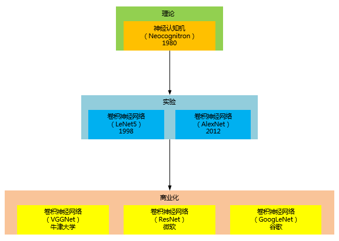

### 卷积神经网络基本概念

> 对于卷积神经网络，我们首先需要了解三个基本的概念：局部感受野（Local Receptive Fields）、共享权值(Shared Weights）、池化（Pooling)。
> 1. 局部感受野 : 对于一般的深度神经网络，往往会把图像的每一个像素点连接到全连接的每一个神经元中，而卷积神经网络则是把每一个隐藏节点只连接到图像的某个局部区域，从而减少参数训练的数量。这个原理从人类视角来讲，即当我们观看一张图像时，更多的时候关注的是局部。
> 2. 共享权值 ：在卷积神经网络的卷积层中，神经元对应的权值是相同的，由于权值相同，因此可以减少训练的参数量。共享的权值和偏置也被称作卷积核（*kernel*）或过滤器（*filter*）。
> 3. 池化 : 由于待处理的图像往往都比较大，而在实际过程中，没有必要对原图进行分析，能够有效获得图像的特征才是最主要的，因此可以采用类似于图像压缩的思想，对图像进行卷积之后，通过一个下采样过程，来调整图像的大小。

## LeNet5网络

LeNet5是1998年由计算机科学家Yann LeCun设计的，该网络采用了基于梯度的反向传播算法对网络进行有监督的训练，实现过程主要是通过交替连接的卷积层和下采样层，将原始图像逐渐转换为一系列的特征图，并且将这些特征传递给全连接的神经网络，以根据图像的特征对图像进行分类。LeNet5运行过程如下图所示：

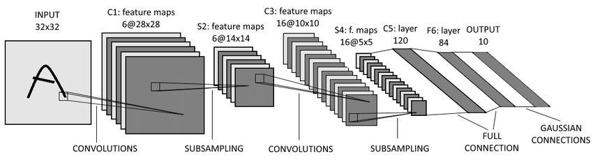

算上输入层的话，LeNet5是一个8层的神经网络，该网络的结构如下图所示：

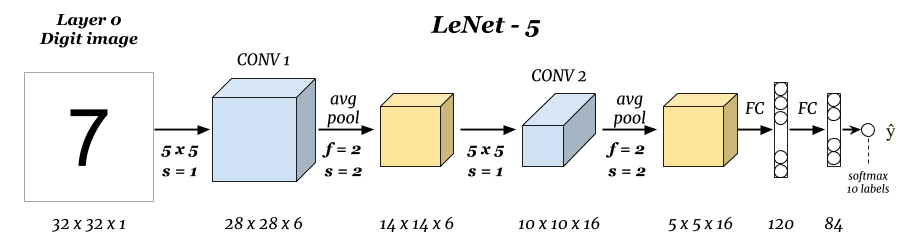

现在我们展开每一层做详细说明：

### Layer-0（输入层）

我们所知说的输入层图片是通过像素来定义的，即每个像素点的颜色不同，其对应的颜色值不同，例如黑白图片的颜色值为0到255，手写体字符，白色的地方为0，黑色为1，如下图，也就是说我们平常说的像素其实就是图片的最小组成，黑白只是0-255，彩色其实就是RGB即三层基色合成的，就可以通过三层下图数值代表即可。

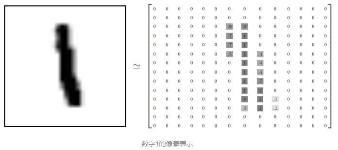

在我们的代码实现中，我们使用的是MNIST数据集，该数据集包含70000张28x28像素的手写数字的单通道灰度图，像素点的颜色值介于0到1之间，数值越接近1表示颜色越白，数值越接近0颜色越黑，为了让大家更好地理解，我们将使用不同色块的图对图片数据*7*进行显示，大家可以在色块条中看到数值与颜色的映射，如下图所示：

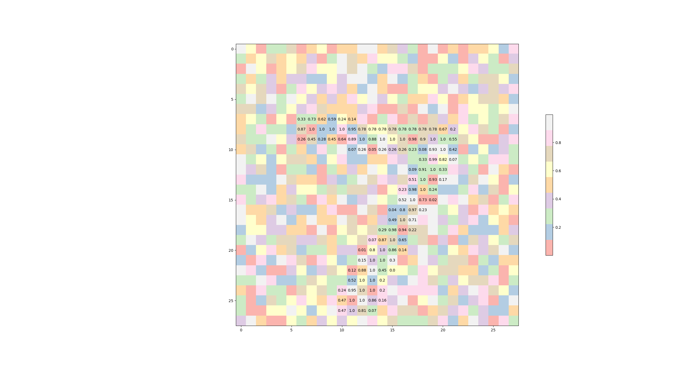

我们定义输入是一个32x32的矩阵，代码如下：

```python
    # 扁平化图片
    x = tf.placeholder(tf.float32, shape=[None, 32*32], name='x')
    # 图片输入层32*32，1个channel的黑白图片
    x_image = tf.reshape(x, [-1, 32, 32, 1]) 
```

### CONV-1（第一层卷积层）

CONV-1层有6个28x28的特征图组成，每个特征图中的任一个元素与该层的输入中一个5x5的区域相连接。如图所示： 

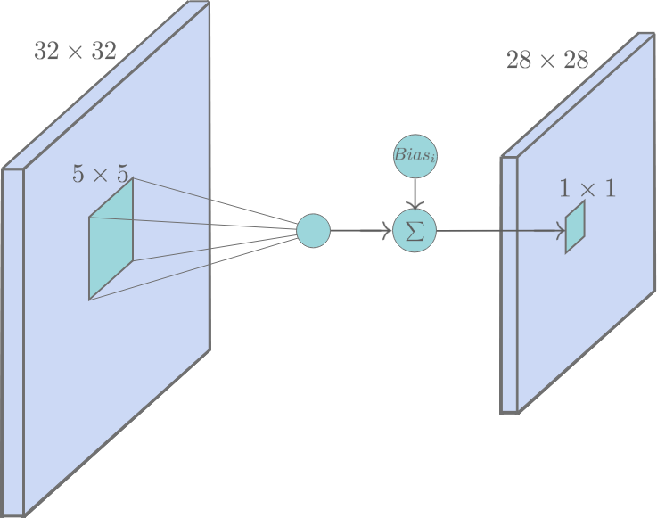

C1层一共有$(5\times 5+1) \times 6 = 156$个可训练的参数，而且一共有$(5 \times 5 + 1) \times 28 \times 28 \times 6 = 122,304$个连接。

### pool-1（第二层池化层-下采样层）

pool-1层是一个池化层，由6个14x14的特征图组成，每一个特征图中元素都与CONV-1层中对应的特征图中一个2x2的相邻区域相连。这里的池化操作为：将4个输入相加，乘上一个可训练的系数，加上一个可训练的偏置，最后经过一个*Relu*函数。

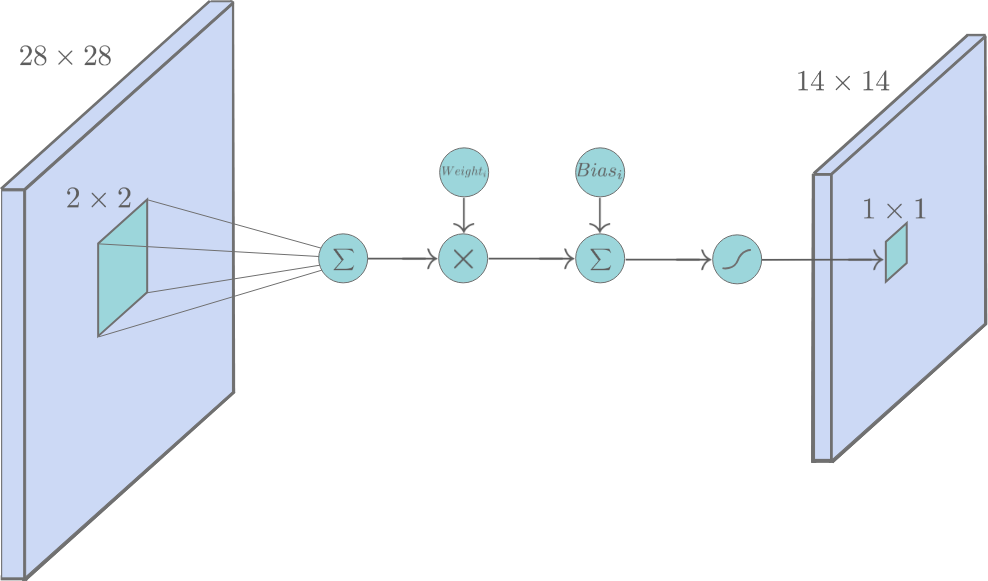

S2层一共有$(1 + 1) \times 6 = 12$个可训练的参数，而且一共有$(2 \times 2 + 1) \times 14 \times 14 \times 6 = 5,880$个连接。 

### CONV-2（第三层卷积层）

CONV-2层由16个10x10的特征图组成，与C1的最大区别是，这里每个特征图中的元素会与pool-1层中若干个特征图中处于相同位置的5x5的区域相连，如图所示：

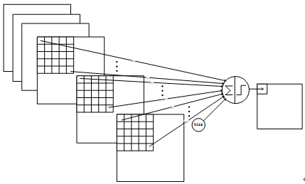

CONV-2的计算方式和CONV-1的不同，CONV-2的前6个特征图以pool-1中3个相邻的特征图子集为输入，然后是6个特征图以pool-1中4个相邻特征图子集为输入，接下来是3个以不相邻的4个特征图子集为输入，最后一个将pool-1中所有特征图为输入。具体如下：

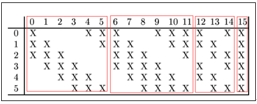

按照上表中的规则连接，C3层一共有$6 \times (3 \times 25 + 1) + 9 \times (4 \times 25 + 1) + 1 \times (6 \times 25 + 1) = 1,516$个可训练的参数，一共有$151,600$个连接。 采用这样的组合，论文中的介绍了两个原因：1）减少参数，2）这种不对称的组合连接的方式有利于提取多种组合特征。

### pool-2（第四层池化层-下采样层）

pool-2层是一个池化层，共计16个5x5的特征图，CONV-2层的16个10x10的图分别进行以2x2为单位的池化得到16个5x5的特征图。有5x5x5x16=2000个连接，连接的方式与pool-1层类似。

### FC-1（第五层卷积层）

FC-1是一个类似CONV-2的卷积层，由120个1x1的特征图组成。但是，与CONV-2层不同的是，这里的连接是一种“全”连接，即每个特征图中的元素与pool-2层中每个特征图都连接。 

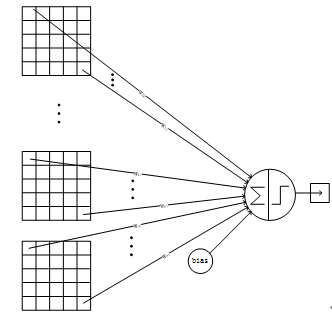

S2层一共有$120 \times(5\times 5 \times 16 + 1 ) = 48,120$个可训练的参数。 

### FC-2（第六层全连接层）

FC-2就是一个简单的全连接层，它由84个神经元构成。和传统的全连接一样每个神经元将FC-1层中的特征图的值乘上相应的权重并相加，再加上对应的偏置再经过*Relu*激活函数。

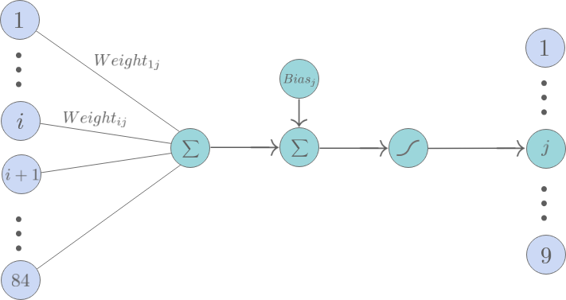

FC-2层有84个节点，对应于一个7x12的比特图，-1表示白色，1表示黑色，这样每个符号的比特图的黑白色就对应于一个编码。该层的训练参数和连接数是(120 + 1)x84=10164。至于为什么要是84这个数字母，在介绍输出层时会解释。

### Layer-out（输出层）

Layer-out层也是全连接层，由10个欧几里得径向基函数核(Euclidean Radial Basis Function, RBF)的构成，每个核对应0-9中的一个类别。输出值最小的那个核对应的 *i* 就是这个模型识别出来的数字。

> 1：RBF核的输出 $y_i = \sum_{j}(x_j - w_{ij})^2$  其中，$x_i \in \vec{X} = \{ x_1, ... , x_i, ... x_{84} \}$，$\vec{X}$就是FC-2层中的神经元的输出组成的向量。 而$w_{ij} \in \vec{w_i} = \{ w_{i1}, ... , w_{ij}, ... w_{i84} \}$，是数字 *i* 对应的RBF核保有的一个常向量。 即，RBF核的输出就是输入向量$\vec{X}$和$\vec{w_i}$的欧几里得距离。 

> 2：RBF核保有的常向量$\vec{w_i}$中的元素是+1或者-1，这些向量被人为设定为可以表示绘制在7x12位图上的字符(0—9)，这也就解释了为什么要将FC-2层设定为84个神经元。至于为什么要这么设计？主要是为了保证该模型在被拓展应用到识别ASCII码时，该模型可以正确区别例如0和大小写O，这种容易混淆的字符。

下图是RBF核保有的常向量对应的bitmap字符：

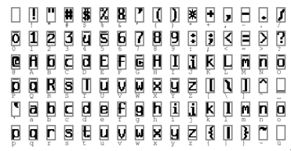

在我们的代码中我们使用*softmax*函数来进行预测值得计算，代码如下：

```python
    layer_outputs = tf.nn.softmax(layer_fc2)
```

## 模型运行的效果

一个输入图片在经过这个模型的过程中，在各个层的样子可以参看下图：

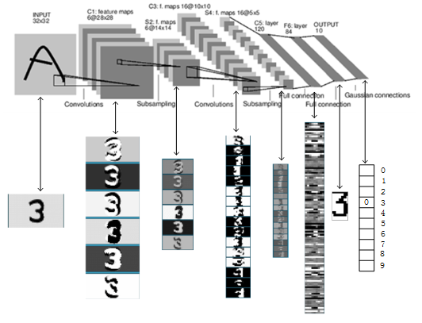

# LeNet5实践

## LeNet5设计模式

根据前面文章的描述，我们开始一步步的代码实现，我们将代码按照算法工程进行结构化搭建，工程结构如下图所示：

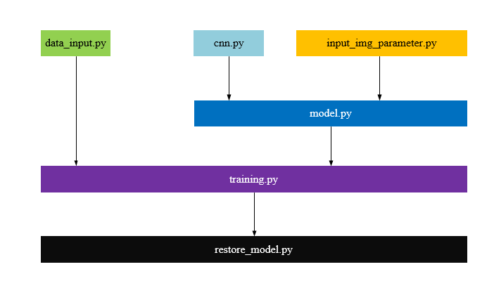

在该项目中我们使用不同训练次数训练后生成两个模型，分别是100次训练模型（model_1h）和10000次训练模型（model_1w），然后对他们的卷积层特征图（feature map）和权值（weights）进行对比和显示，最后对不同模型来预测结果进行对比。

#####  保存训练模型代码实现

```python
    saver = tf.train.Saver()
    saver.save(session, 'checkpoint_dir/my_model')
```

通过TensorFlow_board展示的模型如下图所示：

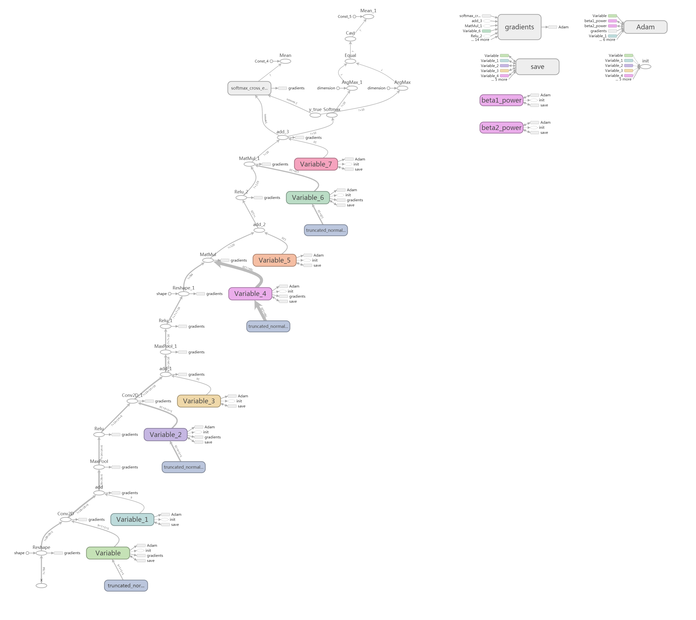

#####  使用训练模型预测的代码实现

```python
    saver = tf.train.Saver()
    ckpt = tf.train.get_checkpoint_state('checkpoint_dir')
    if ckpt and ckpt.model_checkpoint_path:
        saver.restore(sess, ckpt.model_checkpoint_path)
    else:
        raise FileNotFoundError("未保存任何模型")
```

## 结果展示

我们通过训练好的的模型对数字7进行处理，通过图像化训练结果对LeNet5每一层的进行分析，让大家能更加清晰的了解卷积处理过程。

#### 原始数据

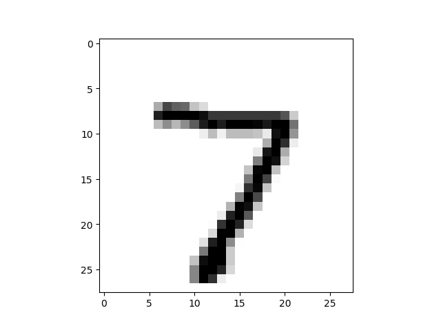

#### 训练次数和准确性

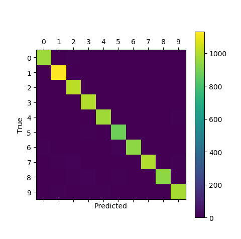

#### 第一层卷积层（CONV-1）的不同次数训练后的权重对比

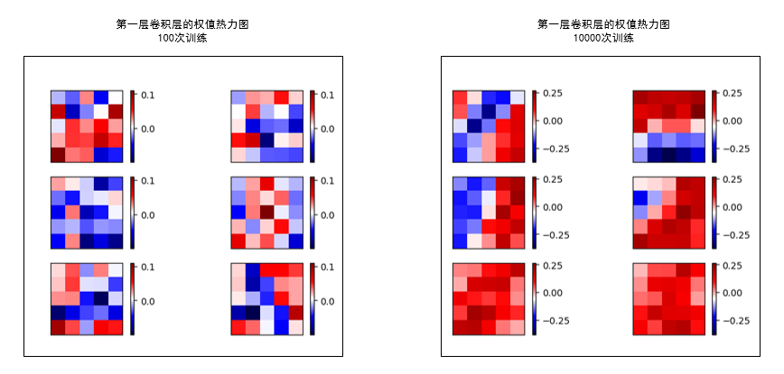

#### 第一层卷积层（CONV-1）的不同次数训练后的特征图对比

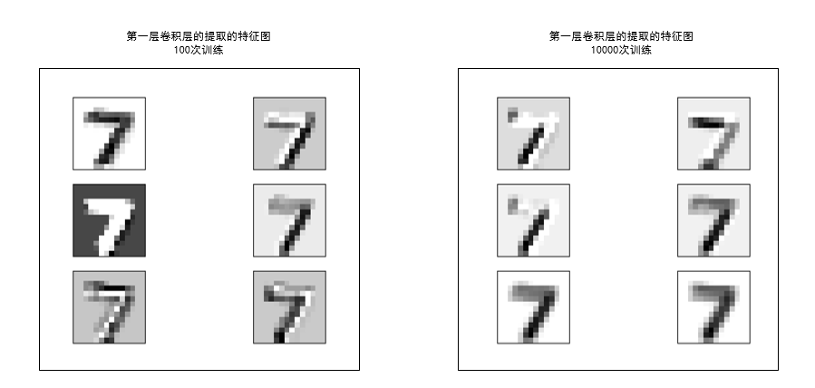

#### 第二层卷积层（CONV-2）的不同次数训练后的权重对比

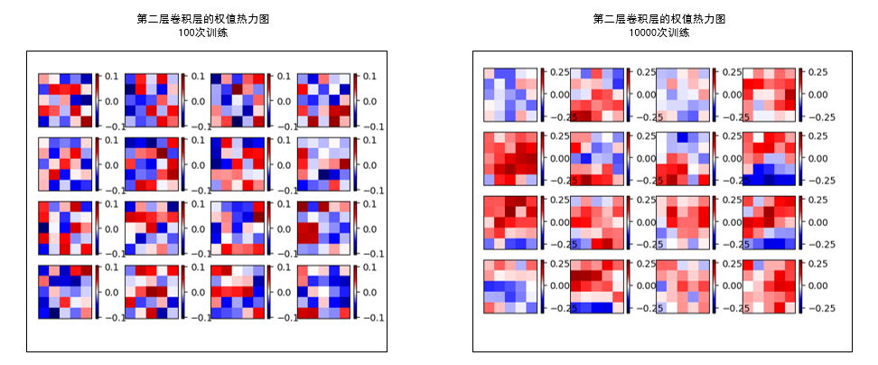

#### 第二层卷积层（CONV-2）的不同次数训练后的特征图对比

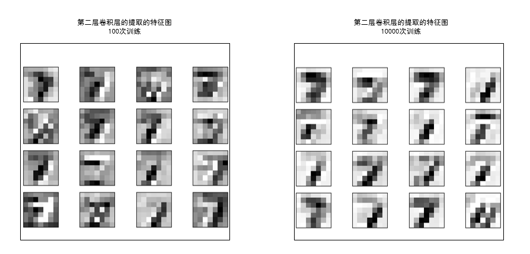

#### 训练的精度和损失变化情况

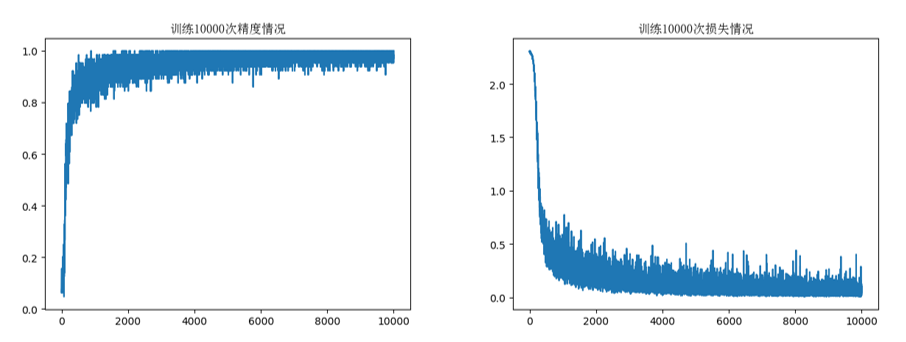

#### 不同次数训练后的误差图对比

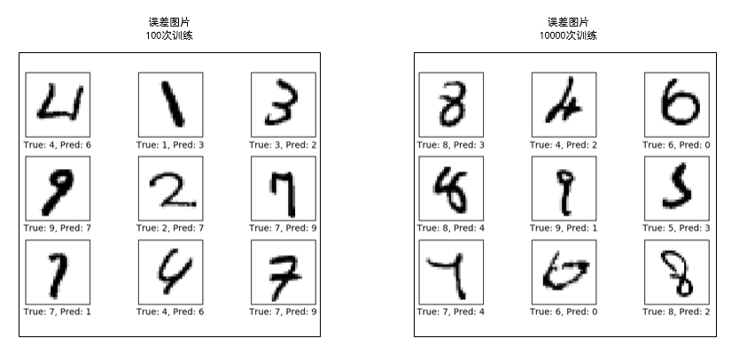

#### 不同次数训练后的预测结果对比

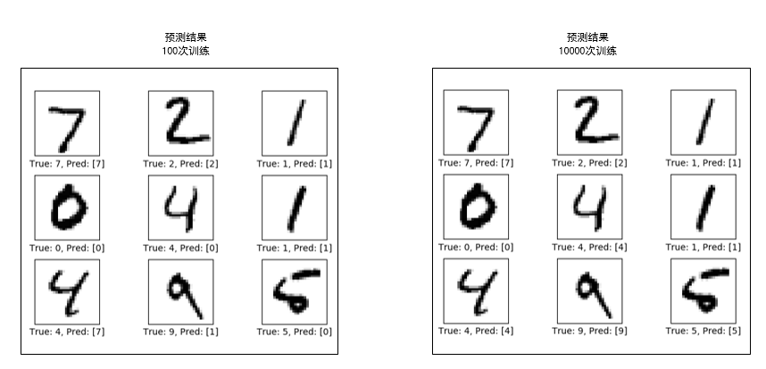

## 小结

LeNet5 这个网络虽然很小，但是它包含了深度学习的基本模块：卷积层，池化层，全链接层。是其他深度学习模型的基础。从目前的发展趋势而言，卷积神经网络将依然会持续发展，并且会产生适合各类应用场景的卷积神经网络，例如，面向视频理解的3D卷积神经网络等。值得说明的是，卷积神经网络不仅仅应用于图像相关的网络，还包括与图像相似的网络，他们在语音识别、物体检测、人脸识别等应用领域的发挥着重要的作用。

