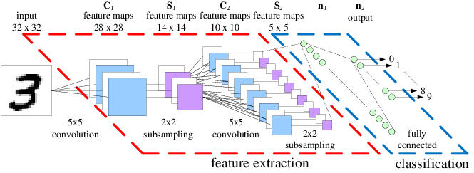

# 用TensorFlow构建一个LeNet5

卷积神经网络是目前深度学习技术领域中非常具有代表性的神经网络之一，在图像分析和处理领域取得了众多突破性的进展，相较于传统的图像处理算法的优点之一在于避免了对图像复杂的前期预处理过程，卷积神经网络可以直接输入原始图像进行一系列工作，至今己经广泛应用于各类图像相关的应用中，下图展示了卷积神经网络的发展历史：

### 卷积神经网络基本概念

> 对于卷积神经网络，我们首先需要了解三个基本的概念：局部感受野（Local Receptive Fields）、共享权值(Shared Weights）、池化（Pooling)。
> 1. 局部感受野 : 对于一般的深度神经网络，往往会把图像的每一个像素点连接到全连接的每一个神经元中，而卷积神经网络则是把每一个隐藏节点只连接到图像的某个局部区域，从而减少参数训练的数量。这个原理从人类视角来讲，即当我们观看一张图像时，更多的时候关注的是局部。
> 2. 共享权值 ：在卷积神经网络的卷积层中，神经元对应的权值是相同的，由于权值相同，因此可以减少训练的参数量。共享的权值和偏置也被称作卷积核（*kernel*）或过滤器（*filter*）。
> 3. 池化 : 由于待处理的图像往往都比较大，而在实际过程中，没有必要对原图进行分析，能够有效获得图像的特征才是最主要的，因此可以采用类似于图像压缩的思想，对图像进行卷积之后，通过一个下采样过程，来调整图像的大小。

### LeNet5网络

LeNet5是1998年由计算机科学家Yann LeCun设计的，该网络采用了基于梯度的反向传播算法对网络进行有监督的训练，实现过程主要是通过交替连接的卷积层和下采样层，将原始图像逐渐转换为一系列的特征图，并且将这些特征传递给全连接的神经网络，以根据图像的特征对图像进行分类。LeNet5过程如下图所示：

