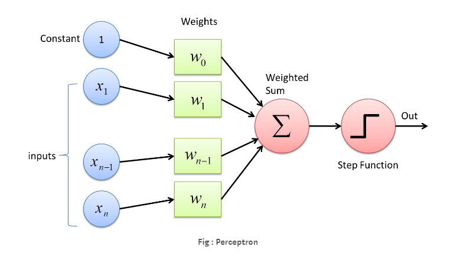
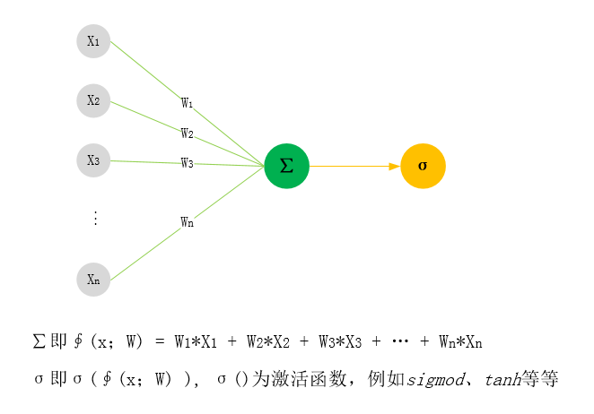
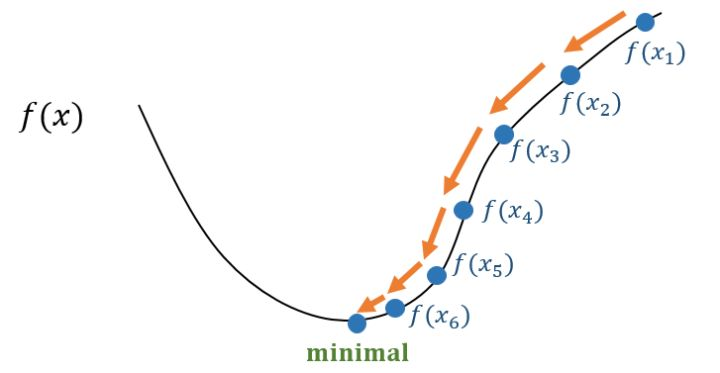

# 深度神经网络的传播方法

------

CNN网络作为神经网络的一种网络，现在已经广泛应用于语音分析和图像识别领域。该文将通过对CNN网络的传播方式的介绍，学习CNN网络实现的算法原理。对于进一步了解CNN网络的转播方式我们首先需要了解DNN网络的传播方式。在此我们以MLP为基础，先介绍DNN网络的传播方式。

感知器「Perceptron」是一种最简单形式的前馈神经网络，是一种二元线性分类器，1957年由康奈尔航空实验室（Cornell Aeronautical Laboratory）的Frank Rosenblatt发明。如果把感知器看做一个厨房，把权重看成不同的食材，那么整个感知器可以看成根据不同食材生成不同菜品的厨房，也就是说厨房根据食材的多少决定了菜的品相。在数学上感知器是一个基本的数学模型，随着权重和阀值的变化，可以得到不同的决策模型。一个感知器模型如下：

perceptron有四个部分：
1. 输入值组或者输入层
2. 权重和偏置
3. Net sum
4. 激活函数

感知机主要的缺陷是它只能处理线性可分问题。

MLP「Multilayer Perceptron，多层感知器」是最朴素的DNN，作为一种前向结构的人工神经网络，映射一组输入向量到一组输出向量。MLP可以被看作是一个有向图，由多个的节点层所组成，每一层都全连接到下一层。除了输入节点，每个节点都是一个带有非线性激活函数的神经元（或称处理单元），既一个感知器。MLP是感知器的推广，克服了感知器不能对线性不可分数据进行识别的弱点。

## 梯度下降

机器学习，一种简单粗暴的理解是通过大量的数据，结合人工设计的模型，通过自动的迭代训练，优化模型自身的各种参数，最终使得在某一组训练参数下该模型能够实现最佳的数据匹配。
MLP作为神经网络的基础模型，在实际场景中，通过自动的迭代训练，能够实现 *学习* 过程。那么在自动的迭代训练中模型的参数是怎么优化的呢？这里我们先建立一种思考方式，首先模型参数优化的结果是模型训练的结果接近真实内容，那么是否比较真实内容与模型训练的结果的差异便可能是优化模型参数的一种依据呢？根据这个假设我们可以思考推导该假设成立的推导过程：
1. 比较差异
2. 通过差异优化参数
3. 验证优化后的差异
4. 重复执行直到差异最小

ok，现在我们根据以上过程思路来做一下数学推导工作。首先是第一步比较差异，为了量化差异我们定义一个代价函数：
$C(w,b) = \frac{1}{2n}\sum_x{} ||y(x)-a||^2$  [1]

这⾥w表⽰所有的⽹络中权重的集合，b是所有的偏置，n是训练输⼊数据的个数，a是表⽰当输⼊为x时输出的向量，求和则是在总的训练输⼊x上进⾏的。因此优化参数w，b，使得$C(w,b) \approx 0$就是我们优化参数的目的。为了实现该目的我们在这里介绍梯度下降法(gradient descent)，该方法是优化问题的经典方法之一。

什么是梯度下降法呢？假设我们已知f(x)为连续可微函数，如果我们能构造一个序列$x^0,x^1,x^2,...$,并满足$f(x^{t+1})<f(x^t)$,t=0,1,2,..., 那么我们就能够不断执行该过程即可收敛到局部极小点。

现在问题的思路是已知一个点$x^t$,如何找到下一个点$x^{t+1}$满足$f(x^{t+1})<f(x^t)$,这里我们需要联系泰勒公式，f(x)对泰勒级数进行一阶展开，可得：

$f(x) \approx f(x_0)+(x-x_0)f'(x_0)$  [2] 

进行对式[2]移项可得：

$f(x) - f(x_0) \approx (x-x_0)f'(x_0)$  [3] 

现在对应梯度有$x_0 = x^t$, $x = x^{t+1}$, 式[3]可以表示为式[4]：

$$ f(x^{t+1}) \approx f(x^t) + (x^{t+1} - x^t)f'(x^t) $$ 

$x^{t+1}$与$x^t$距离很近，使用下式[5]表示关系：

$$ x^t + \Delta x = x^{t+1}$$

将式[5]带入式[4]中，有式[6]如下：

$$ f(x^{t+1}) \approx f(x^t) + \Delta xf'(x^t) $$ 

令$\Delta x=-\alpha f'(x^t)$,式[6]变化为式[7]如下：

$$ f(x^{t+1}) \approx f(x^t) -\alpha (f'(x^t))^2 $$ 

现在式[7]保证了$f(x^{t+1})<f(x^t)$，其中$\alpha$在梯度下降方法中叫做步长，式[5]可表示为式[8]如下：

$$ x^{t+1} = x^t -\alpha f'(x^t) $$

以上推导过程就是使用泰勒公式推导梯度下降的过程。通过梯度下降对代价函数进行优化，可以达到优化参数w和b的目的。

## 反向传播算法

神经网络使用梯度下降算法来学习他们自身的权重和偏置。那么怎么计算代价函数的梯度呢？这里使用反向传播算法来计算。反向传播的核心是一个对代价函数C关于任何权重w（或者偏置b）的偏导数$\partial C/\partial w$的表达式，通过改变w和b，可以改变整个网络的行为。

####反向传播的四个方程式：

> BP1. &#160;&#160;&#160;&#160;  $\delta^L =  \nabla_aC ⊙ \sigma'(z^L)$ 
> BP2. &#160;&#160;&#160;&#160;  $\delta^l =  (w^{l+1})^T\delta^{l+1} ⊙ \sigma'(z^l)$  
> BP3. &#160;&#160;&#160;&#160;  $\partial C/ \partial b_j^l =  \delta_j^l$
> BP4. &#160;&#160;&#160;&#160;  $\partial C/ \partial w_{jk}^l =  a_k^{l-1}\delta_j^l$

这里我们定义一个中间量，$\delta_j^l$, 即$l^{th}$层第$j^{th}$个神经元上的误差。$z^l$是$l^{th}$层第$j^{th}$个神经元上的带权输入。$\delta_j^l$的大小决定了代价函数对$l^{th}$层第$j^{th}$个神经元的依赖程度，不太依赖$\delta_j^l$就会小，反之变大。

基于反向传播的四个方程式我们可以得出反向传播算法，这里我们省略了以上4个方程式的推导，有兴趣的同学可以自己去看一下，网上有很多相关内容。

####反向传播算法过程：

> 1. 输入x: 为输入层设置对应的激活值$a^1$
> 2. 前向传播: 对每个l = 2， 3，..., L计算相应的$z^l = w^l a^{l-1} + b^l$和$a^l = sigma(z^l)$
> 3. 输出层误差$\delta^L$: 计算向量$\delta^L = \nabla_aC ⊙ \sigma'(z^l)$
> 4. 反向误差传播：$l = L-1,L-2, ...,2$, 计算$\delta^l =  ((w^{l+1})^T\delta^{l+1}) ⊙ \sigma'(z^l)$
> 5. 输出：代价函数的梯度由$\partial C/ \partial w_{jk}^l =  a_k^{l-1}\delta_j^l$ 和 $\partial C/ \partial b_j^l =  \delta_j^l$得出

####梯度下降法的训练过程：

> 1. 输入训练样本的集合
> 2. 对每个训练样本x:设置对应的输入激活$a^{x,1}$,并执行下面的步骤：
>> *  前向传播： 对每个$l = 2, 3, ...,L $计算$z^{x,l} = w^la^{x,l-1} + b^l$ 和 $a^{x,l} = \sigma(z^{x,l})$
>> *  输出误差$\delta^{x,L} =  \nabla_aC ⊙ \sigma'(z^{x,L})$
>> *  反向传播误差：对每个$l = L-1,L-2, ...,2$, 计算$\delta^{x,l} =  ((w^{l+1})^T\delta^{x,l+1}) ⊙ \sigma'(z^{x,l})$
> 3. 梯度下降：对每个$l = L-1,L-2, ...,2$, 根据$w^l \rightarrow w^l - \eta/m\sum_x\delta^{x,l}(a^{x,l-1})^T$ 和$b^l \rightarrow b^l - \eta/m\sum_x\delta^{x,l}$更新权重和偏执