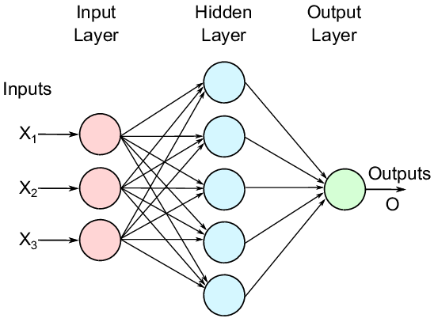

# 卷积神经网络的传播方法

------

CNN网络作为神经网络的一种网络，现在已经广泛应用于语音分析和图像识别领域。该文将通过对CNN网络的传播方式的介绍，学习CNN网络实现的算法原理。对于进一步了解CNN网络的转播方式我们首先需要了解DNN网络的传播方式。在此我们以MLP为基础，先介绍DNN网络的传播方式。

感知器「Perceptron」是一种最简单形式的前馈神经网络，是一种二元线性分类器，1957年由康奈尔航空实验室（Cornell Aeronautical Laboratory）的Frank Rosenblatt发明。如果把感知器看做一个厨房，把权重看成不同的食材，那么整个感知器可以看成根据不同食材生成不同菜品的厨房，也就是说厨房根据食材的多少决定了菜的品相。在数学上感知器是一个基本的数学模型，随着权重和阀值的变化，可以得到不同的决策模型。一个感知器模型如下：

perceptron有四个部分：
1. 输入值组或者输入层
2. 权重和偏置
3. Net sum
4. 激活函数

感知机主要的缺陷是它只能处理线性可分问题。

MLP「Multilayer Perceptron，多层感知器」是最朴素的DNN，作为一种前向结构的人工神经网络，映射一组输入向量到一组输出向量。MLP可以被看作是一个有向图，由多个的节点层所组成，每一层都全连接到下一层。除了输入节点，每个节点都是一个带有非线性激活函数的神经元（或称处理单元），既一个感知器。MLP是感知器的推广，克服了感知器不能对线性不可分数据进行识别的弱点。

