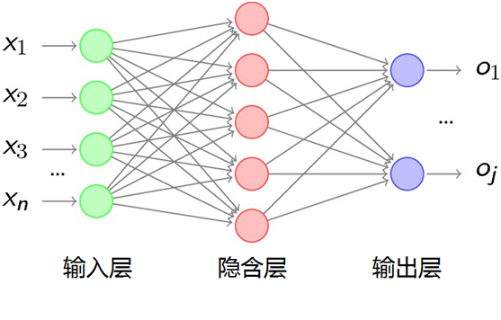
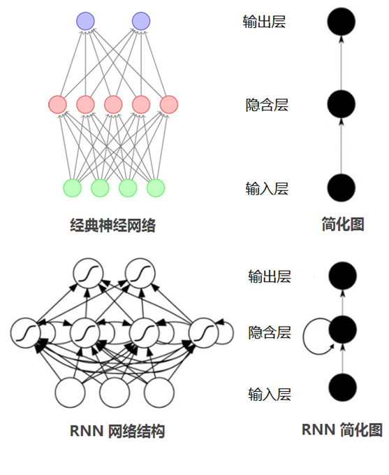
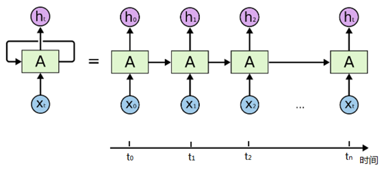

# RNN介绍

经典的人工神经网络、深度神经网络（DNN），甚至卷积神经网络（CNN），一是输入的数据维度相同，另外是各个输入之间是独立的，每层神经元的信号只能向上一层传播，样本的处理在各个时刻独立。

在实际应用过程中，例如对一个演讲进行语音识别，那演讲者每讲一句话的时间几乎都不太相同，而识别演讲者的讲话内容必须要按照讲话的顺序进行识别；再例如对一段文字信息进行分析，按照文字前后顺序进行内容填空，以上两个例子中DNN和CNN都无法有效的解决问题。这就需要有一种能力更强的模型：**该模型具有一定的记忆能力**，能够按时序依次处理任意长度的信息，这个模型就是“循环神经网络”（Recurrent Neural Networks，简称RNN）。

循环神经网络（RNN）的神经元（rnn_cell）的输出可以在下一个时间戳直接作用到自身（作为输入），看看下面的对比图：

从上面的两个简化图，可以看出RNN相比经典的神经网络结构多了一个循环圈，这个圈就代表着神经元的输出在下一个时间戳还会返回来作为输入的一部分，这些循环让RNN看起来似乎很神秘，然而，换个角度想想，也不比一个经典的神经网络难于理解。RNN可以被看做是对同一神经网络的多次赋值，第i层神经元在t时刻的输入，除了（i-1）层神经元在该时刻的输出外，还包括其自身在（t-1）时刻的输出，如果我们按时间点将RNN展开，将得到以下的结构图：

在不同的时间点，RNN的输入都与将之前的时间状态有关，tn时刻网络的输出结果是该时刻的输入和所有历史共同作用的结果，这就达到了**对时间序列建模**的目的。

接下来我们将通过RNN实现一个小游戏来深入了解RNN的原理，*Roll Game*是这个小游戏的名字，该游戏通过训练一个RNN网络来对一组二进制数据进行预测。

### 数据集介绍

*Roll Game*所使用的数据集很简单，包含X,Y两个二进制序列。X是按照一定长度生成一个随机的二进制序列，其中0,1出现的概率都是50%，Y是X的二进制序列沿X轴的正方形移动roll_steps后生成的二进制序列，Y是X的标签。

我们分别用了7个过程来讲解RNN网络，包括:

> * [自定义rnn_cell的基础RNN实现](https://github.com/applepip/neutral_network/tree/master/trensorflow_rnn/tensorflow_rnn_roll_game)
