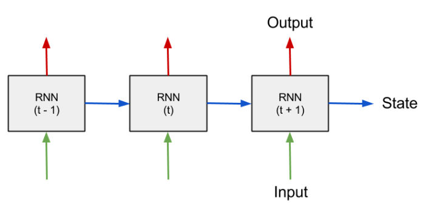
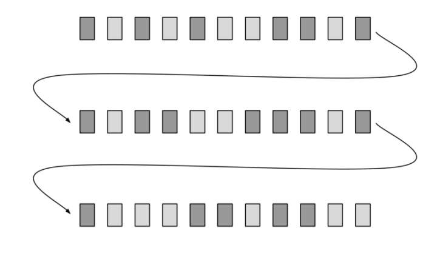
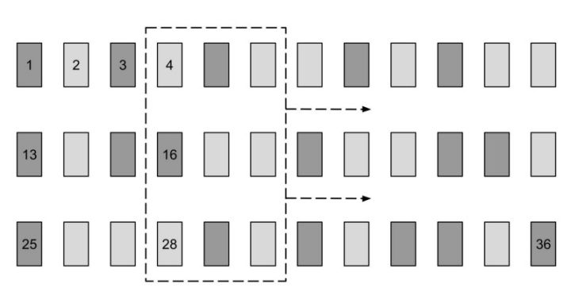
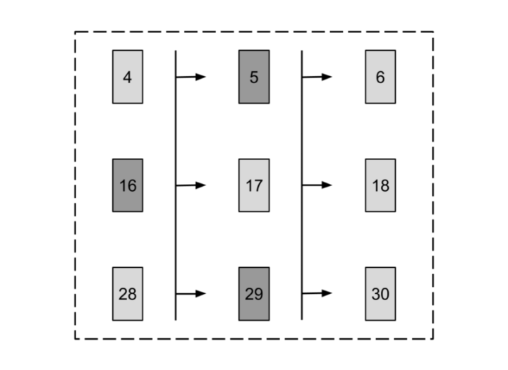
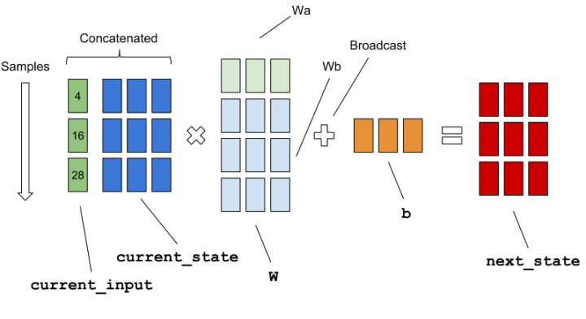

# 用TensorFlow构建一个简单的RNN

------

> 本文作者leon, 基于深度学习工程师Erik Hallström的一篇[博客](https://medium.com/@erikhallstrm/hello-world-rnn-83cd7105b767)，对如何在TensorFlow环境中构建一个简单的循环神经网络进行深度解析并进行代码实践,文章引用了相关内容和图片。

RNN的特点是能结合数据点之间的特定顺序和幅值大小等多个特征，来处理序列数据。特别是，这种网络的输入序列可以是任意长度的。

我们将通过*roll game*这个小游戏来讲解基础的RNN，*roll game*将生成一个数字时间序列，具体任务是根据先前值来预测后续值。在每个时间步中，循环神经网络的输入是**当前值**，以及一个表征该网络在之前的时间步中**已经获得信息的状态向量**；通过输入的当前值，和已获得的信息状态向量计算输出量和新的信息状态向量。该信息该状态向量是RNN网络的编码记忆单元，在训练网络之前初始化为零向量。RNN处理序列数据的步骤如下图所示：



关于RNN的介绍，强烈推荐[《A Critical Review of Recurrent Neural Networks for Sequence Learning》](https://link.zhihu.com/?target=https%3A//arxiv.org/pdf/1506.00019.pdf)，这篇出自加州大学圣地亚哥分校研究人员的文章介绍了几乎所有最新最全面的循环神经网络。

## 生成batch数据

在数据集基础上reshape数据，将数据重构为新矩阵。神经网络的训练，利用小批次数据（mini-batch），来近似得到关于神经元权重的损失函数梯度。在训练过程中，小批次操作能防止过拟合和降低硬件压力。整个数据集通过数据重构转化为一个矩阵，并将其分解为多个小批次数据。重构数据矩阵的示意图如下，箭头曲线指示了在不同行上的相邻时间步。浅灰色矩形代表“0”，深灰色矩形代表“1”。



**实现代码：**
```python
    x = x.reshape((batch_size, -1))  
    y = y.reshape((batch_size, -1))
```

## 构建计算图
首先在TensorFlow中建立一个计算图，指定将要执行的运算。该计算图的输入和输出通常是多维数组，也被称为张量（tensor）。我们可以利用CPU、GPU和远程服务器的计算资源，在会话中迭代执行该计算图。

下图表示了输入数据矩阵，以及虚线窗口指出了占位符的当前位置。在每次运行时，这个“批处理窗口”根据箭头指示方向，以定义好的长度从左边滑到右边。在示意图中，batch_size（批数据数量）为3，truncated_backprop_length（截断反传长度）为3，total_series_length（全局长度）为36。这些参数是用来示意的，与实际代码中定义的值不一样。在示意图中序列各点也以数字标出。训练数据的示意图，用虚线矩形指示当前批数据，用数字标明了序列顺序。



**实现代码：**
```python
    batchX_placeholder = tf.placeholder(tf.float32, [batch_size, truncated_backprop_length])
    batchY_placeholder = tf.placeholder(tf.int32, [batch_size, truncated_backprop_length])
```

## 前向传播

下一步我们开始构建RNN计算图的前向传播部分，首先我们要以相邻的时间步分割批数据。下图是将数据拆分为多列的原理图，用数字标出序列顺序，箭头表示相邻的时间步。



在我们的时间序列数据中，在三个位置同时开启训练，所以在前向传播时需要保存三个状态。我们在参数定义时就已经考虑到这一点了，故将init_state设置为3。

下图展示了一次batch单元输入的矩阵计算方式：



**实现代码：**
```python
    # Forward pass
    for current_input in inputs_series:
    current_input = tf.reshape(current_input, [batch_size, 1])
    input_and_state_concatenated = tf.concat([current_input, current_state],1)  # Increasing number of columns

    next_state = tf.tanh(tf.matmul(input_and_state_concatenated, W) + b)  # Broadcasted addition
    states_series.append(next_state)
    current_state = next_state
```

## 计算Loss

这是计算图的最后一部分，我们建立了一个从状态到输出的全连接层，用于softmax分类。该计算过程中输出结果标签矩阵的格式为[batch_size，num_classes]，通过执行AdagradOptimizer()函数，TensorFlow将自动执行反向传播函数：对每批数据执行一次计算图，并逐步更新网络权重。